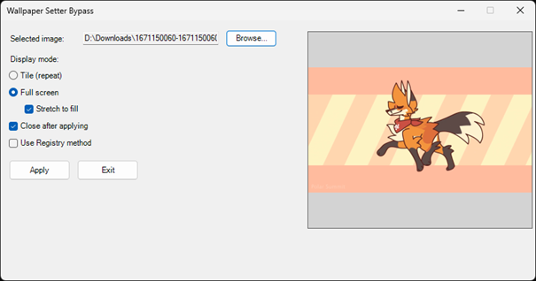

# Wallpaper Setter Bypass (WSB)

**Français** | [English](README.md)

Application PowerShell qui contourne l'interface native de Windows pour définir les fonds d'écran directement avec options avancées de mise à l'échelle et de style. Fonctionne sans privilèges administrateur.




## Fonctionnalités

- [x] **Support Dual Méthode** : Choisir entre la Windows API native ou la manipulation du registre
- [x] **Mode GUI** : Interface graphique interactive pour une sélection facile du fond d'écran
- [x] **Mode CLI** : Interface en ligne de commande pour l'automatisation et les scripts
- [x] **Validation d'image** : Validation automatique pour détecter les fichiers image corrompus ou invalides
- [x] **Mise à l'échelle d'images** : Agrandir les petites images à la résolution de l'écran avec interpolation au plus proche voisin
- [x] **Options d'étirement** : Choisir entre affichage centré ou étiré du fond d'écran
- [x] **Aperçu d'image** : Aperçu en direct de l'image sélectionnée avant application
- [x] **Fermeture automatique** : Option de fermeture automatique après application du fond d'écran
- [x] **Nettoyage automatique** : Supprime automatiquement les images temporaires agrandies après application
- [x] **Pas de Droits Admin** : Fonctionne sans privilèges administrateur en utilisant les méthodes basées sur le registre

## Formats d'image supportés

- JPG / JPEG
- PNG
- BMP
- GIF
- TIFF / TIF

## Configuration requise

- Windows 7 ou version ultérieure
- PowerShell 3.0 ou version ultérieure
- Aucun droit spécial requis

## Utilisation

### Mode GUI (Interactif)

Exécutez simplement le fichier launcher batch :

```cmd
launcher.bat
```

Ou exécutez directement le script PowerShell :

```powershell
.\wallpaper_setter.ps1
```

Cela ouvre une fenêtre où vous pouvez :

1. Cliquer sur **`Browse...`** pour sélectionner un fichier image
2. Voir l'aperçu de l'image sur le côté droit
3. Cocher les options souhaitées :
   - **Étirer pour remplir l'écran** : Étire l'image pour remplir tout l'écran
   - **Agrandir les petites images** : Agrandit les images plus petites que la résolution de votre écran
   - **Fermer après application** : Ferme automatiquement la fenêtre après la définition du fond d'écran
   - **Utiliser la méthode Registre** : Utiliser la manipulation du registre au lieu de l'API Windows native (essayer ceci si la méthode par défaut échoue)
4. Cliquer sur **`Apply`** pour définir le fond d'écran
5. Cliquer sur **`Exit`** pour fermer sans appliquer les modifications

### Mode CLI (Ligne de commande)

Utilisez la syntaxe suivante pour l'utilisation en ligne de commande :

```powershell
.\wallpaper_setter.ps1 -Path "C:\chemin\vers\image.jpg" [Options]
```

#### Options :

- `-Path <chemin>` (obligatoire) : Chemin complet du fichier image
- `-ScaleUp` : Agrandir les petites images à la résolution de l'écran
- `-Stretch` : Étirer l'image pour remplir l'écran au lieu de maintenir le rapport d'aspect
- `-CloseAfter` : Fermer l'application après application
- `-UseRegistryMethod` : Utiliser la méthode de manipulation du registre au lieu de l'API native
- `-Help` : Afficher le message d'aide

#### Exemples :

Appliquer une image avec mise à l'échelle :

```powershell
.\wallpaper_setter.ps1 -Path "C:\Users\MonUtilisateur\Images\image.jpg" -ScaleUp
```

Appliquer une image étirée pour remplir l'écran :

```powershell
.\wallpaper_setter.ps1 -Path "C:\Users\MonUtilisateur\Images\image.jpg" -Stretch
```

Appliquer une image avec toutes les options et fermeture automatique :

```powershell
.\wallpaper_setter.ps1 -Path "C:\Users\MonUtilisateur\Images\image.jpg" -ScaleUp -Stretch -CloseAfter
```

Appliquer une image en utilisant la méthode Registre :

```powershell
.\wallpaper_setter.ps1 -Path "C:\Users\MonUtilisateur\Images\image.jpg" -UseRegistryMethod
```

Afficher l'aide :

```powershell
.\wallpaper_setter.ps1 -Help
```

## Fonctionnement

WSB contourne les Paramètres Windows standard en modifiant directement la configuration du fond d'écran :

1. **Mode GUI** : Lance une fenêtre interactive utilisant Windows Forms pour sélectionner et configurer les paramètres du fond d'écran
2. **Mise à l'échelle d'image** : Si la mise à l'échelle est activée, l'image est agrandie en utilisant l'interpolation au plus proche voisin pour correspondre à la résolution de votre écran tout en maintenant la qualité
3. **Approche Dual Méthode** :
   - **Méthode par défaut** : Utilise l'API Windows native (`SystemParametersInfo`) pour rafraîchir directement le fond d'écran
   - **Méthode Registre** : Manipule directement les paramètres du registre Windows :
     - `Wallpaper` : Chemin vers l'image de fond d'écran
     - `WallpaperStyle` : 2 pour étirer, 6 pour centrer
     - `TileWallpaper` : Défini sur 0 (pas de mosaïque)
4. **Stratégie de Repli** : Si la méthode par défaut échoue en mode GUI, propose automatiquement d'essayer la méthode Registre
5. **Actualisation du Bureau** : Déclenche l'affichage immédiat du fond d'écran sans nécessiter un redémarrage du système

## Dépannage

**Erreur de politique d'exécution PowerShell ?**

Si vous voyez "Le fichier ne peut pas être chargé car l'exécution de scripts est désactivée", utilisez le fichier launcher batch à la place :

```cmd
launcher.bat
```

Cela contourne les restrictions de politique d'exécution. Alternativement, activez l'exécution de scripts :

```powershell
Set-ExecutionPolicy -ExecutionPolicy Bypass -Scope CurrentUser
```

**L'image n'est pas appliquée ?**

- Vérifiez que le chemin du fichier image est correct
- Assurez-vous que le fichier image est dans un format supporté et non corrompu
- Essayez d'utiliser le flag `-UseRegistryMethod` si la méthode par défaut ne fonctionne pas
- Assurez-vous que le Registre Windows est accessible (non restreint par les stratégies de groupe)

**La méthode Registre est lente ou ne fonctionne pas ?**

La méthode registre peut prendre un moment pour actualiser le fond d'écran. Si cela ne s'applique pas immédiatement :

- Attendez quelques secondes et le fond d'écran devrait se mettre à jour
- Essayez d'appliquer à nouveau - parfois la méthode registre nécessite plusieurs tentatives pour prendre effet
- Utilisez le fichier launcher batch si la politique d'exécution empêche le script PowerShell de s'exécuter

**L'aperçu ne se charge pas ?**

L'aperçu peut ne pas se charger pour les formats non supportés. Vous pouvez toujours appliquer le fond d'écran en utilisant le chemin du fichier image.

## Notes

- Les images temporaires agrandies sont automatiquement nettoyées après application du fond d'écran
- L'application stocke le chemin du fond d'écran dans votre registre utilisateur
- Les chemins réseau (chemins UNC) sont supportés pour les fichiers image
- Les fichiers image sont validés avant traitement pour détecter les corruptions

## Licence

Ce projet est distribué sous la **Licence LGPL v3 (GNU Lesser General Public License v3)**. Consultez le fichier [LICENSE](LICENSE) pour plus de détails.

## Contributions

Les contributions, améliorations et pull requests sont acceptées avec plaisir et grandement appréciées ! N'hésitez pas à :

- Signaler des problèmes
- Soumettre des pull requests avec des améliorations
- Suggérer de nouvelles fonctionnalités
- etc

Merci pour l'aide !
